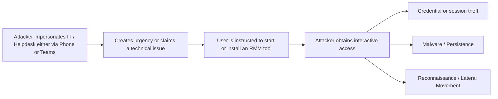
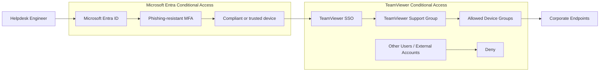

# Reducing the Attack Surface Against Fake IT Helpdesk Attacks

## Introduction

This blog is written from the perspective of an existing enterprise that wants to defend against Fake IT Helpdesk Attacks and/or standardize its remote support process.

Threat actors are increasingly impersonating IT and Helpdesk personnel to exploit the trust users place in legitimate support processes. Instead of relying on malware or software vulnerabilities for initial access, attackers may contact employees through phone calls, Microsoft Teams, or other communication channels and convince them to approve remote access, install Remote Management Tools, provide credentials, or accept elevation prompts. Microsoft has documented multiple recent campaigns where attackers impersonated IT personnel through Teams and then convinced users to provide remote access through legitimate support tooling such as Quick Assist.

Recent examples demonstrate that this is not a theoretical scenario:

Odido, February 2026: Odido confirmed that attackers associated with ShinyHunters impersonated members of its IT staff and contacted customer service employees through voice phishing. One of these attacks resulted in unauthorized access and the exfiltration of customer data.

**The less ambiguity there is around how IT support operates, the harder it becomes for an attacker to convincingly impersonate IT.**

The goal is to create one predictable and recognizable Helpdesk process. Employees should know which tool is used, how legitimate Helpdesk personnel contact them, what actions they may be asked to perform, and, equally important, what they should never be asked to do. On the technical side the software should be correctly configured and have the appropiate security controlls in place.

## Understanding the Attack

A typical Fake IT Helpdesk attack starts with an attacker contacting a user while impersonating IT support. The attacker creates urgency, convinces the user to start or install a Remote Management Tool, and then obtains interactive access to the device. The user on the other side generally does not have the technical know how and can fall for this sort of social engineering.



Legitimate RMM software is attractive to attackers because it already provides many capabilities required for hands-on-keyboard access, while its executables and network traffic may be considered legitimate within an enterprise environment.

Some remote-support tools can also run as portable or per-user applications without requiring administrative installation. Controls focused only on removing local administrator rights or preventing privileged software installation may therefore not be sufficient. The objective should be to clearly define which Remote Management Tools are authorized and how they may be used.

#### Portable RMM Software examples

| Product                     | Standard-user capability                                                                                                                                                                                                             | Vendor documentation                                                                                                                    |
| --------------------------- | ------------------------------------------------------------------------------------------------------------------------------------------------------------------------------------------------------------------------------------ | --------------------------------------------------------------------------------------------------------------------------------------- |
| **TeamViewer QuickSupport** | Runs as a single executable without installation or Windows administrative rights. Administrative rights are only needed later if the technician needs to interact with UAC/elevated applications.                                   | TeamViewer explicitly states that QuickSupport “runs without installation or Windows or macOS administrative rights.” ([TeamViewer][1]) |
| **AnyDesk Portable**        | Can be downloaded and executed without installation and without administrator privileges. The session remains unelevated and cannot normally interact with UAC until elevated.                                                       | AnyDesk documents Portable Mode as not requiring administrator privileges. ([AnyDesk Help Center][2])                                   |
| **Splashtop SOS**           | The SOS executable can be downloaded and run directly by the user. Splashtop specifically documents it as running in Windows/macOS user space without installation. A standard-user session cannot interact with UAC until elevated. | Splashtop SOS documentation confirms both the no-install model and standard-user operation. ([Splashtop On-Prem Support][3])            |
| **Zoho Assist**             | Supports browser-based attended remote support without software installation or administrator privileges. It can initially operate at user level and has a separate elevation process for administrative operations.                 | Zoho explicitly states that its browser-based remote support requires neither installation nor elevated permissions. ([Zoho][4])        |

[1]: https://www.teamviewer.com/en/global/support/knowledge-base/teamviewer-classic/modules/quicksupport/?utm_source=chatgpt.com "QuickSupport"
[2]: https://support.anydesk.com/portable-vs-installed?utm_source=chatgpt.com "Installation"
[3]: https://support-splashtoponprem.splashtop.com/hc/en-us/articles/900000386743-Introduction-to-Splashtop-SOS?utm_source=chatgpt.com "Introduction to Splashtop SOS – Splashtop On-Prem - Support"
[4]: https://www.zoho.com/assist/remote-desktop/remote-desktop-software-without-download.html?utm_source=chatgpt.com "Remote Access Without Download or Installation - Zoho Assist"

**Disclaimer**

These type of applications (Zoho Assist not included) can be prevented with "WDAC" however many organisations do not choose to use this due to the administration overhead this brings.

## Discovering RMM Software with Microsoft Defender

### Why Inventory Matters

Before defining what should be allowed, determine what is already present in the environment.

### RMM Detection with KQL

Introduce the KQL detection used to identify known RMM products through processes, filenames, and other indicators.

**KQL Query**

```kql
// RMM discovery query
// To be added
```

### Reviewing the Results

Discuss:

* Expected RMM tooling
* Unexpected RMM tooling
* Legacy tools
* User-installed tools
* Tools that should no longer exist

## RMM Deployment Through Microsoft Intune

### What Is Intune Deploying?

Use Microsoft Graph / Intune reporting to determine whether known RMM software is centrally deployed.

```text
Microsoft Graph endpoints and examples to be added.
```

Compare this with the Defender findings.

The goal is to answer:

**Is this remote access software present because IT deliberately deployed it?**

## Standardizing Remote Support

### Selecting the Approved RMM Platform

Discuss the process for selecting the organization's approved remote support solution.

Topics:

* Authentication
* MFA
* RBAC
* Logging
* Session auditing
* Device deployment
* Administrative access

### Deploying the Approved Platform

Discuss deploying the approved tooling centrally through Intune or another managed deployment mechanism.

### Removing Unnecessary RMM Tools

Reduce the number of remote support products that users could reasonably believe belong to IT.

## Microsoft Teams External Communication

### External Chat as an Attack Surface

Discuss how attackers can use Teams external communication to contact users while pretending to represent IT or another trusted organization.

### Reviewing Teams External Access

Review the relevant Teams external communication settings.

```text
Teams configuration and Graph endpoints to be added.
```

### Defining What Is Actually Required

Determine whether unrestricted external communication is required or whether the configuration can be reduced based on business requirements.

## Establishing a Clear IT Support Process

Technical controls should support a clearly defined internal process.

Document:

* How IT contacts employees
* Which remote support platform IT uses
* How a support session is initiated
* Whether users are ever expected to install software
* How an employee can verify that the person contacting them is actually IT
* What IT will never ask an employee to do

### Example: TeamViewer Integration, Setup, Security Controls, Security Awareness

#### Enable TeamViewer Integration

First, enable the TeamViewer integration within your Microsoft Intune environment.

Go to the [Microsoft Intune admin center](https://intune.microsoft.com).

Navigate to **Tenant administration** and select **Connectors and tokens**.



Select **TeamViewer connector**.



Enable the **TeamViewer Connector** and complete the required authorization process to connect your TeamViewer environment with Microsoft Intune.

For the complete configuration and additional setup options, refer to the official TeamViewer documentation:

[TeamViewer Intune Integration Installation and User Guide](https://www.teamviewer.com/en/global/support/knowledge-base/teamviewer-tensor-classic/integrations/intune-integration-installation-and-user-guide/)

#### Deploy TeamViewer Client

The TeamViewer client should be deployed as a mandatory application through Microsoft Intune.

Users should not be required to download or install remote management software themselves. This supports a consistent Helpdesk process and allows users to be explicitly instructed never to install Remote Management Tools when requested during a support interaction.

Because the approved client is already installed, any request to download additional remote access software should be treated as suspicious.

#### Configure SSO for TeamViewer

Configure Single Sign-On using Microsoft Entra ID for TeamViewer support accounts.

SSO centralizes authentication, removes the need for separate TeamViewer credentials, and allows existing Entra ID security controls such as MFA and Conditional Access to be applied. It also simplifies onboarding and offboarding of Helpdesk personnel.

This supports the goal of a single, recognizable remote support procedure where both the user and the Helpdesk rely on the same centrally managed process.

For configuration guidance, refer to the official TeamViewer documentation:

[Single Sign-On for Microsoft Entra ID](https://www.teamviewer.com/en/global/support/knowledge-base/teamviewer-tensor-classic/sso/single-sign-on-for-microsoft-entra-id/)

#### Configure Helpdesk Roles for TeamViewer

Within Microsoft Intune, assign Helpdesk personnel only the permissions required to initiate remote assistance sessions. The built-in **Help Desk Operator** role is intended for remote support activities and should be preferred over broader administrative roles. Microsoft recommends using Intune RBAC and least-privilege permissions instead of assigning elevated Microsoft Entra roles for daily support activities.

For the TeamViewer integration specifically, Helpdesk personnel require permission to read the remote assistance connector and initiate remote assistance sessions.



This keeps the approved remote-support process available to Helpdesk personnel without granting unnecessary Intune or Entra administrative privileges.

See this example of a connection to a device via Intune.



> **Security Disclaimer:** When providing remote support, any credentials or authentication tokens used during the session may be processed or stored on the remote user's device and could potentially be exposed if that device is compromised. Helpdesk personnel should therefore never use highly privileged accounts such as Global Administrator, Security Administrator, or Domain Administrator on standard user endpoints unless explicitly required and appropriately controlled. Administrative accounts should be separated by privilege tier and used according to the principles of least privilege and privileged access separation. Where local elevation is required, prefer device-specific or scoped administrative credentials rather than broad privileged identities.

#### Configure Conditional Access for TeamViewer

Conditional Access should be applied at two different stages of the remote support process.

**1. Protect TeamViewer Console authentication**

When TeamViewer is integrated with Microsoft Entra ID using SSO, configure an **Entra Conditional Access policy** for the TeamViewer Enterprise Application. For Helpdesk and TeamViewer administrators, require at minimum:

* Phishing-resistant MFA
* A compliant or otherwise trusted administrative device
* Access only for the required Helpdesk and administrative groups

This protects access to TeamViewer accounts and the management environment. Microsoft recommends phishing-resistant MFA for privileged identities and supports requiring compliant devices through Conditional Access.

**2. Protect remote connections to endpoints**

If TeamViewer Tensor Conditional Access is available, configure separate rules controlling which support identities are allowed to connect to managed devices.

A possible model is:



TeamViewer Conditional Access uses a deny-by-default model once rule verification is enabled. Rules can be created between approved users or user groups and managed device groups. Session permissions can also be restricted, for example by denying file transfer, switching sides, or other functionality that is not required by the Helpdesk.

This creates two separate security boundaries: Microsoft Entra Conditional Access protects **who can authenticate to TeamViewer**, while TeamViewer Conditional Access controls **who can establish a remote connection to a corporate endpoint via TeamViewer**.

**Disclaimer**

I do not specifically recommend TeamViewer or this exact configuration. TeamViewer and other Remote Management Tool vendors provide similar security controls, such as allowlists, blocklists, SSO, and access restrictions. The purpose of this blog is to demonstrate how remote support can be standardized into a single, recognizable Helpdesk process and to highlight the security controls that can be used to reduce the risk of social engineering and unauthorized remote access.

#### Other Security Options

Please review https://www.teamviewer.com/en/global/support/knowledge-base/teamviewer-remote/security/security-statement/ to see all the security options Team Viewer has to offer.

* Bring your own Certificate
* Block & Allow Lists

#### Disclaimer

I do not specifically recommend TeamViewer; however, due to its native integrations, it provides a good example of how a Remote Management Tool can be selected, centrally configured, and streamlined into a single, understandable support process. This makes it easier to train employees to recognize and follow only the approved Helpdesk process, reducing the likelihood of successful social engineering and improving overall security awareness.

## Turning Technical Controls into Security Awareness

This is where the technical controls and employee training come together.

Instead of training employees using vague statements such as:

> Be careful when someone claims to be IT.

The organization can provide much stronger rules:

> IT only uses our approved remote support platform.

> IT will never ask you to install another remote access tool.

> IT will only contact you through our documented support process.

> External Teams users are never authorized to perform IT support.

These statements become possible because the tenant and operational processes have been configured to make them true.

## Bringing It All Together

The objective is to remove as much uncertainty as possible.

Microsoft Defender provides visibility into remote access tooling already present on endpoints.

Microsoft Intune provides visibility and control over what IT deliberately deploys.

Teams configuration reduces unnecessary communication paths.

Standardized IT processes define exactly what legitimate support looks like.

Security awareness can then be built around those technical and procedural absolutes.

## Conclusion

Fake IT helpdesk attacks exploit trust and ambiguity.

A well-configured environment cannot eliminate social engineering, but it can make the attacker's story much harder to believe.

The end goal is simple:

**Make legitimate IT support predictable, controlled, and verifiable.**
